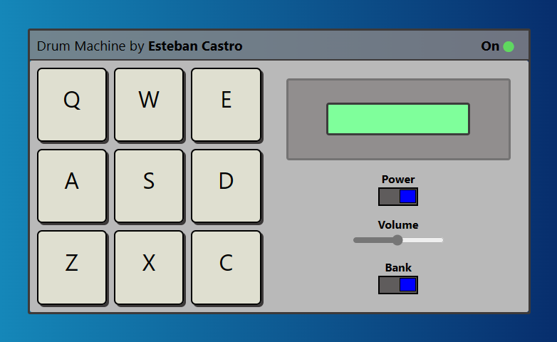

# Drum Machine React.js

Este proyecto lo desarrollé como parte de mi certificación en librerías de desarrollo frontend con freeCodeCamp. Consiste en una app sintetizadora de sonidos desarrollada en React.js, donde se utilizan diferentes características de la librería como la configuración de estados con useState y UseEfect, renderizado condicional con operadores ternarios, renderizado dinámico, estructuras de datos, responsive design. Es un ejercicio bastante completo y útil para trabajar lógica en JSX.

## características

[Click para ver la versión en vivo del proyecto](https://codepen.io/ecastroc/full/VwVymmY)
